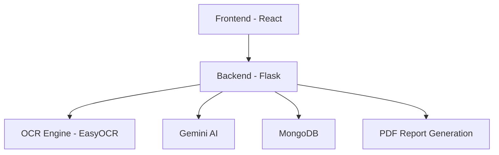
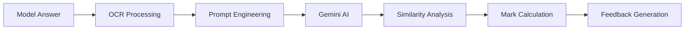

# 🎓 AI Examiner

An intelligent web platform that uses AI to evaluate student answers against model responses, generate detailed feedback, and support teacher-led academic workflows.

[](https://reactjs.org/)
[](https://flask.palletsprojects.com/)
[](https://www.mongodb.com/)
[](https://ai.google.dev/)
[](LICENSE)


## 🌐 Live Demo

- Live Website: TBD
- Video Demo: TBD
- GIF Demo: TBD

---

## 🧭 Overview

AI Examiner is designed to reduce the manual burden of academic evaluation. It helps educators compare student submissions with model answers, extract content from PDFs and images, and produce structured feedback with marks and suggestions using AI.

This project was built to be useful for:
- Teachers who want faster grading workflows
- Schools and universities managing large exam volumes
- Students who benefit from actionable feedback
- Open-source contributors exploring full-stack AI applications

### Why it matters
- Speeds up evaluation
- Improves consistency in grading
- Supports OCR-based document processing
- Makes assessment data easier to manage and review

---

## ✨ Features

### 🤖 AI Features

| Feature | Description |
| --- | --- |
| AI-Powered Evaluation | Uses Google Gemini AI to assess answers intelligently |
| Mark Calculation | Automatically assigns marks based on answer quality |
| Feedback Generation | Produces strengths, improvement areas, and suggestions |
| Similarity Analysis | Compares student answers with model answers |

### 🧾 OCR Features

| Feature | Description |
| --- | --- |
| PDF Processing | Upload and parse PDF-based submissions |
| OCR Integration | Extracts handwritten and printed text using EasyOCR |
| Image Support | Supports PNG, JPG, and JPEG inputs |
| Text Cleanup | Helps convert scanned documents into usable content |

### 👩‍🏫 Teacher Features

| Feature | Description |
| --- | --- |
| Teacher Management | Add and manage teacher records |
| Student Management | Maintain student profiles and roll numbers |
| Evaluation History | Browse past evaluations and results |
| Export Reports | Download evaluation reports as PDF |

### 🎓 Student Features

| Feature | Description |
| --- | --- |
| Submission Review | View evaluation results for completed assessments |
| Feedback Access | Review AI-generated comments and suggestions |
| Structured Results | Understand performance through clear scoring summaries |

### 🖥️ UI Features

| Feature | Description |
| --- | --- |
| Modern Dashboard | Clean interface for quick navigation |
| Responsive Layout | Works on desktop and tablet screens |
| Search & Filters | Find evaluations by student, teacher, or date |
| Dark Theme Friendly UI | A polished experience for extended use |

### 📄 Report Features

| Feature | Description |
| --- | --- |
| Detailed Evaluation Reports | Includes marks, feedback, and analysis |
| Professional PDF Output | Reports can be exported in a structured format |
| History Tracking | Keeps a record of prior evaluations |

---

## 📸 Screenshots

| View | Placeholder |
| --- | --- |
| Dashboard |  |
| Evaluation Page |  |
| Result Page |  |
| Management |  |
| History |  |

---

## ▶️ Demo

- Live Website: TBD
- Video Demo: TBD
- GIF Demo: TBD

---

## 🏗️ System Architecture



---

## 🧠 AI Workflow



---

## 🛠️ Tech Stack

| Category | Technologies |
| --- | --- |
| Frontend | React, React Router, Axios, Tailwind CSS, Framer Motion |
| Backend | Flask, Flask-CORS, PyMongo, JWT, Gunicorn |
| Database | MongoDB |
| AI | Google Gemini AI |
| OCR | EasyOCR, pdf2image, PyPDF2 |
| Tools | Docker, Nginx, Python, Node.js |
| Deployment | Local development, Docker Compose, cloud-ready setup |

---

## 📁 Project Structure

```text
ai-examiner/
├── backend/
│   ├── app.py
│   ├── config.py
│   ├── requirements.txt
│   ├── models/
│   └── utils/
├── frontend/
│   ├── public/
│   └── src/
│       ├── components/
│       ├── pages/
│       └── services/
└── README.md
```

---

## ⚙️ Installation

### Prerequisites

- Node.js 16+ (18+ recommended)
- Python 3.8+
- MongoDB (local or cloud instance)
- Google Gemini API key
- Poppler (for PDF processing)

### 1. Clone the repository

```bash
git clone https://github.com/yourusername/ai-examiner.git
cd ai-examiner
```

### 2. Backend setup

```bash
cd backend
python -m venv venv

# Windows
venv\Scripts\activate

# macOS / Linux
source venv/bin/activate

pip install -r requirements.txt
```

### 3. Frontend setup

```bash
cd ../frontend
npm install
```

### 4. Install Poppler

<details>
<summary>OS-specific setup</summary>

- Windows: download Poppler from the official release page and add it to your PATH.
- macOS: `brew install poppler`
- Linux: `sudo apt-get install poppler-utils`

</details>

### 5. Run the application

```bash
# Backend
cd ../backend
python app.py

# Frontend (new terminal)
cd ../frontend
npm start
```

The backend will run on `http://localhost:5000` and the frontend on `http://localhost:3000`.

---

## 🔐 Environment Variables

Create a `.env` file in the backend directory with the following values:

```env
# .env.example
MONGO_URI=mongodb://localhost:27017/
MONGO_URI_FALLBACK=
MONGO_DB_NAME=ai_examiner

GEMINI_API_KEY=your-gemini-api-key-here
GEMINI_API_KEYS=

UPLOAD_FOLDER=uploads
MAX_FILE_SIZE=16777216
ALLOWED_EXTENSIONS=pdf,png,jpg,jpeg

JWT_SECRET=dev_change_me
JWT_ALGORITHM=HS256
ACCESS_TOKEN_MINUTES=30
REFRESH_TOKEN_DAYS=7

SMTP_HOST=
SMTP_PORT=587
SMTP_USER=
SMTP_PASSWORD=
SMTP_FROM=

FRONTEND_URL=http://localhost:3000
ADMIN_EMAIL=
ADMIN_PASSWORD=
ADMIN_NAME=Admin
```

---

## 🚀 Usage

1. **Add teachers and students**
   - Navigate to the Management page
   - Create teacher and student profiles

2. **Upload evaluation content**
   - Upload a model answer PDF or paste text
   - Select teacher and student records
   - Upload the student answer PDF

3. **Run evaluation**
   - Enter maximum marks
   - Click **Evaluate** to generate AI-based results

4. **Review and export**
   - Access detailed feedback and marks
   - View history and export reports as PDF

---

## 🔌 API Endpoints

| Endpoint | Method | Description |
| --- | --- | --- |
| `/api/health` | GET | Health check for the API and database |
| `/api/auth/register` | POST | Register a new user |
| `/api/auth/login` | POST | Authenticate a user |
| `/api/teachers` | GET/POST | List or create teachers |
| `/api/students` | GET/POST | List or create students |
| `/api/evaluations` | GET | Retrieve evaluation history |
| `/api/upload-model-answer` | POST | Upload model answer PDF |
| `/api/evaluate-answer` | POST | Evaluate a student submission |
| `/api/ocr-only` | POST | Extract text from uploaded files without evaluation |

---

## ⚡ Performance

| Metric | Details |
| --- | --- |
| OCR Engine | EasyOCR |
| AI Model | Google Gemini |
| Supported Formats | PDF, PNG, JPG, JPEG |
| Max Upload Size | 16 MB (configurable) |
| Response Time | Depends on document size and AI processing load |

---

## 🔒 Security

This project applies several defensive measures:
- Input validation for API payloads
- File type validation for uploaded documents
- CORS configuration for cross-origin access
- Error handling for database and evaluation failures
- JWT-based authentication flow for protected routes

---

## 🗺️ Future Roadmap

- [x] OCR processing
- [x] AI evaluation
- [x] Teacher and student management
- [x] Evaluation history and reporting
- [ ] Authentication improvements
- [ ] Docker optimization
- [ ] Mobile app experience
- [ ] LMS integration
- [ ] Multi-language support

---

## 🤝 Contributing

Contributions are welcome. To contribute:

1. Fork the repository
2. Create a feature branch: `git checkout -b feature/amazing-feature`
3. Commit your changes: `git commit -m "Add amazing feature"`
4. Push to your branch: `git push origin feature/amazing-feature`
5. Open a pull request

Please keep changes focused, documented, and aligned with the project’s goals.

---

## 📝 License

This project is licensed under the MIT License.

---

## 🙏 Acknowledgements

- Google Gemini AI for powerful language understanding
- MongoDB for reliable data storage
- React and Flask communities for excellent tooling and documentation
- All contributors and testers

---

## 👤 Author

Built with care by the CodeWizards🧙‍♂️ Team.

---

## 💬 Support

If you like this project, please consider giving it a star ⭐

If you encounter issues or want to suggest improvements, feel free to open an issue or start a discussion.


